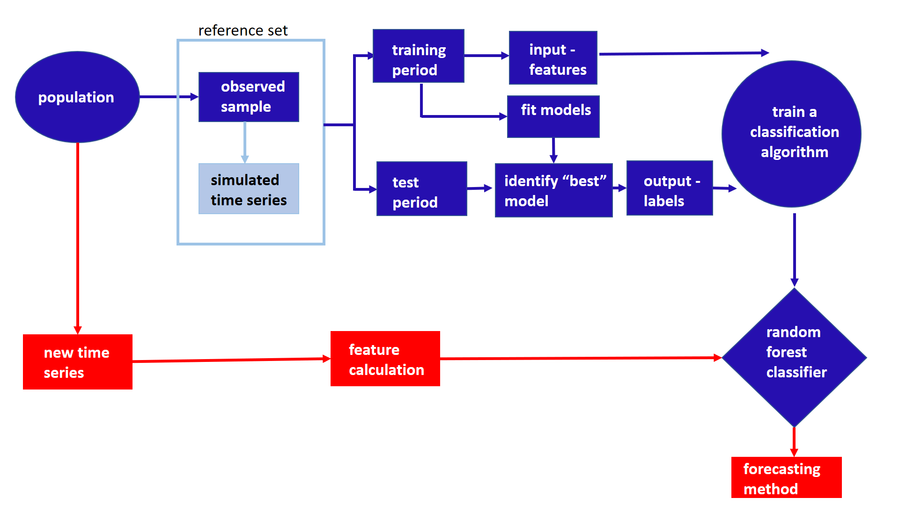

```{r setup, include=FALSE}
knitr::opts_chunk$set(echo = FALSE, cache=TRUE, messages=FALSE, warning=FALSE)
# Make sure you have the latest version of rmarkdown and bookdown
#devtools::install_github("rstudio/rmarkdown")
#devtools::install_github("rstudio/bookdown")
library(ggplot2)
```

#Introduction

We use Feature-based FORecast-Model Selection (FFORMS) framework introduced in [@fforms] over the course of the M4 forecasting competition. The underlying approach involves computing a vector of features from the time series we will be forecasting which are then used to select the forecasting model. The model selection process is carried out using a classification algorithm -- we use the time series features as inputs, and the best forecasting model as the output. A Random Forest approach is used to develop the classifier. The classification algorithm can be built in advance of the forecasting exercise (so it is an “offline” procedure). Then, when we have a new time series to forecast, we can quickly compute its features, use the pre-trained classification algorithm to identify the best forecasting model, and produce the required forecasts. Thus, the “online” part of our algorithm requires only feature computation, and the application of a single forecasting model, with no need to estimate large numbers of models within a class, or to carry out a computationally-intensive cross-validation procedure. This framework is implemented in the open source R package `seer` and is publicly available on github (https://github.com/thiyangt/seer). 

#FFORMS framework: application to M4 competition data

```{r framework, fig.cap="FFORMS (Feature-based FORecast-Model Selection) framework. The offline phase is shown in blue and the online phase by red.", out.width = "400px", fig.pos="h"}

```


As shown in \autoref{fig:framework}, the FFORMS framework consists of two main components: i) *offline phase*, which includes the development of a classification model and ii) *online phase*, use the classification model developed in the offline phase to identify "best" forecast-model. We develop separate classifiers for yearly, monthly, quarterly, weekly, daily and hourly series. Now we will illustrate the implementation of FFORMS framework over the course of the M4 competition.

## FFORMS framework: offline phase

### observed sample

We split the time series in the M4 competition into training set and test set. The time series in the training set are used as the set of observed time series. The time series in the test set are used to evaluate the classification models. Further, for yearly, quarterly and monthly time series in addition to the time series provided in the M4 competition we used the time series of M1 and M3 competitions. Table \ref{observedsample} summarizes the number of time series in the observed sample and the test set in each frequency category.

\begin{table}[!h]
\centering
\caption{Composition of the time series in the observed sample and the test set}
\label{observedsample}
\begin{tabular}{l|rrr|r}
\multirow{2}{*}{Frequency} & \multicolumn{3}{l|}{Observed Sample} &  Test set \\ 
                  &   M1    &    M3   &    M4  &  M4 \\ \hline
  Yearly          &   181    &   645    &   22000   & 1000 \\
  Quarterly       &   203    &    756   &   23000   &  1000\\
  Monthly         &   617    &    1428   &  47000    &  1000\\
  Weekly          &   -    &   -    &   259   & 100 \\
  Daily           &   -    &   -    &   4001   & 226 \\
  Hourly          &   -    &    -   &  350    & 64\\ \hline
\end{tabular}
\end{table}

### simulated time series

As described in @fforms, we augment the reference set by adding multiple time series simulated based on each series in the M4 competition. We use several standard automatic forecasting algorithms to simulate multiple time series from each series. Table \ref{simulation} shows the different automatic forecasting algorithms used under each frequency category. The automated ETS and ARIMA are implemented using `ets` and `auto.arima` functions available in the forecast package in R [@forecast]. The `stlf` function in the forecast package [@forecast] is used to simulate multiple time series based on multiple seasonal decomposition approach. As shown in Table \ref{simulation} we fit models to each time series in the M4 competition database from the corresponding algorithm and then simulate multiple time series from the selected models. Before simulating time series from daily and hourly series we convert the time series into multiple seasonal time series (msts) objects. For daily time series with length less 366 the frequency is set to 7 and if the time series is long enough to take more than a year (length > 366), the series is converted to a multiple seasonal time series objects with frequencies 7 and 365.25. For hourly series, if the series length is shorter than 168, frequency is set to 24, if the length of the  series is greater than 168 and less than or equals to 8766 only daily and weekly seasonality are allowed setting the frequencies to 24 and 168. In this experiment the length of the simulated time series is set to be equal to: length of the training
period specified in the M4 competition + length of the forecast horizon specified in the competition. For example, the series with id
"Y13190" contains a training period of length 835. The length of the simulated series generated based on this series is equals to 841 (835+6).

\begin{table}[!h]
\centering
\caption{Automatic forecasting algorithms used to simulate time series}
\label{simulation}
\begin{tabular}{lllllll}
 Algorithm & Y & Q & M & W & D &  H \\ \hline
 automated ETS & \checkmark & \checkmark & \checkmark &  &  &  \\
automated ARIMA & \checkmark & \checkmark & \checkmark &  &  &  \\
forecast based on multiple seasonal decomposition &  &  &  & \checkmark & \checkmark & \checkmark\\ \hline
\end{tabular}
\end{table}

As shown in \autoref{fig:framework}, the observed time series and the simulated time series form the reference to build our classification algorithm. Once we create the reference set for random forest training we split each time series in the reference set into training period and test period. 

### Input: features

The FFORMS framework operates on the features of the time series. For each time series in the reference set features are calculated based on the training period of the time series. 

\begin{table}[!htp]
\centering\footnotesize\tabcolsep=0.12cm
\caption{Time series features}
\label{feature}
\begin{tabular}{llp{8,8cm}cccc}
\toprule
\multicolumn{2}{c}{Feature} & Description & Y & Q/M & W & D/H\\
\midrule
1  & T              & length of time series                                                                   & \yes  & \yes & \yes & \yes\\
2  & trend          & strength of trend                                                                       & \yes  & \yes & \yes & \yes\\
3  & seasonality 1    & strength of seasonality corresponds to frequency 1                                                              & -     & \yes & \yes & \yes\\
4  & seasonality 2    & strength of seasonality corresponds to frequency 2                                                              & -     & - & -& \yes\\
5  & linearity      & linearity                                                                               & \yes  & \yes & \yes & \yes\\
6  & curvature      & curvature                                                                               & \yes  & \yes & \yes & \yes\\
7  & spikiness      & spikiness                                                                               & \yes  & \yes & \yes & \yes\\
8  & e\_acf1        & first ACF value of remainder series                                                     & \yes  & \yes & \yes & \yes\\
9  & stability      & stability                                                                               & \yes  & \yes & \yes & \yes\\
10  & lumpiness      & lumpiness                                                                               & \yes  & \yes & \yes & \yes\\
11 & entropy        & spectral entropy                                                                        & \yes  & \yes & \yes & \yes\\
12 & hurst          & Hurst exponent                                                                          & \yes  & \yes & \yes & \yes\\
13 & nonlinearity   & nonlinearity                                                                            & \yes\ & \yes & \yes & \yes\\
14 & alpha          & ETS(A,A,N) $\hat\alpha$                                                                 & \yes  & \yes & \yes & -\\
15 & beta           & ETS(A,A,N) $\hat\beta$                                                                  & \yes  & \yes & \yes & - \\
16 & hwalpha        & ETS(A,A,A) $\hat\alpha$                                                                 & -     & \yes & - & -\\
17 & hwbeta         & ETS(A,A,A) $\hat\beta$                                                                  & -     & \yes & - & - \\
18 & hwgamma        & ETS(A,A,A) $\hat\gamma$                                                                 & -     & \yes & - &-\\
19 & ur\_pp         & test statistic based on Phillips-Perron test                                            & \yes  & - & - & - \\
20 & ur\_kpss       & test statistic based on KPSS test                                                       & \yes  & - & - & - \\
21 & y\_acf1        & first ACF value of the original series                                                  & \yes  & \yes & \yes & \yes\\
22 & diff1y\_acf1   & first ACF value of the differenced series                                               & \yes  & \yes & \yes & \yes\\
23 & diff2y\_acf1   & first ACF value of the twice-differenced series                                         & \yes  & \yes & \yes & \yes\\
24 & y\_acf5        & sum of squares of first 5 ACF values of original series                                 & \yes  & \yes & \yes & \yes\\
25 & diff1y\_acf5   & sum of squares of first 5 ACF values of differenced series                              & \yes  & \yes & \yes & \yes\\
26 & diff2y\_acf5   & sum of squares of first 5 ACF values of twice-differenced series                        & \yes  & \yes & \yes & \yes \\
27 & seas\_acf1     & autocorrelation coefficient at first seasonal lag                                       & -     & \yes & \yes & \yes\\
28 & sediff\_acf1   & first ACF value of seasonally-differenced series                                        & -     & \yes & \yes & \yes\\
29 & sediff\_seacf1 & ACF value at the first seasonal lag of seasonally-differenced series                    & -     & \yes & \yes & \yes\\
30 & sediff\_acf5   & sum of squares of first 5 autocorrelation coefficients of seasonally-differenced series & -     & \yes & \yes & \yes\\
31 & lmres\_acf1    & first ACF value of residual series of linear trend model                                & \yes  & - & - & -\\
32 & y\_pacf5       & sum of squares of first 5 PACF values of original series                                & \yes  & \yes & \yes & \yes\\
33 & diff1y\_pacf5  & sum of squares of first 5 PACF values of differenced series                             & \yes  & \yes & \yes & \yes\\
34 & diff2y\_pacf5  & sum of squares of first 5 PACF values of twice-differenced series                       & \yes  & \yes & \yes & \yes\\
\bottomrule
 \end{tabular}
\end{table}

The description of the features calculated under each frequency category is shown in Table \ref{feature}. A comprehensive description of the features used in the experiment is given in @fforms.

### Output: class-labels

In addition to the class labels used by @fforms we include some more class labels when applying the FFORMS framework to the M4 competition time series. The description of class labels considered under each frequency is shown in Table \ref{classlabels}. We fit the corresponding models outlined in Table \ref{classlabels} to each series in the reference set. The models are estimated using the training period for each series, and forecasts are produced for the test periods. 

\begin{table}[!htp]
\centering\footnotesize\tabcolsep=0.12cm
\caption{Class labels}
\label{classlabels}
\begin{tabular}{llrrrr}
class label & Description & Y & Q/M & W & D/H \\ \hline
WN & white noise process & \checkmark & \checkmark & \checkmark & \checkmark \\
AR/MA/ARMA & AR, MA, ARMA processes & \checkmark & \checkmark & \checkmark & -\\
ARIMA & ARIMA process & \checkmark & \checkmark & \checkmark & - \\
SARIMA & seasonal ARIMA & \checkmark & \checkmark & \checkmark & -\\
RWD & random walk with drift & \checkmark & \checkmark & \checkmark & \checkmark \\
RW & random walk & \checkmark & \checkmark & \checkmark & \checkmark  \\
Theta & standard theta method & \checkmark & \checkmark & \checkmark & \checkmark \\
STL-AR &  & - & \checkmark & \checkmark & \checkmark \\
ETS-notrendnoseasonal & ETS without trend and seasonal components & \checkmark & \checkmark & \checkmark & - \\
ETStrendonly & ETS with trend component and without seasonal component & \checkmark & \checkmark & \checkmark & -\\
ETSdampedtrend & ETS with damped trend component and without seasonal component  & \checkmark &  \checkmark & - & - \\
ETStrendseasonal & ETS with trend and seasonal components & - & \checkmark & - & - \\
ETSdampedtrendseasonal & ETS with damped trend and seasonal components & - & \checkmark & - & -\\
ETSseasonalonly & ETS with seasonal components and without trend component & -  & \checkmark & - & - \\
snaive & seasonal naive method & \checkmark & \checkmark & \checkmark & \checkmark \\
tbats & TBATS forecasting & - & \checkmark & \checkmark & \checkmark \\
nn & neural network time series forecasts & \checkmark & \checkmark & \checkmark & \checkmark \\
mstlets &  & - & - & \checkmark & \checkmark \\
mstlarima & & - & - & - & \checkmark \\\hline
\end{tabular}
\end{table}

The `auto.arima` and `ets` functions in the forecast package are used to identify the suitable (S)ARIMA and ETS models. In order to identify the "best" forecast-model for each time series in the reference set we combine the mean Absolute Scaled Error (MASE) and the symmetric Mean Absolute Percentage Error (MAPE) calculated over the test set. More specifically, for each series both forecast error measures MASE and sMAPE are calculated for each of the forecast models. Each of these is respectively standardized by the median MASE and median sMAPE calculated across the methods. The model with the lowest average value of the scaled MASE and scaled sMAPE is selected as the output class-label. Most of the labels given in Table \ref{classlabels} are self-explanatory labels. In STL-AR, mstlets, and mstlarima, first STL decomposition method applied to the time series and then seasonal naive method is used to forecast the seasonal component. Finally,  AR, ETS and ARIMA models are used to forecast seasonally adjusted data respectively.


### Train a random forest classifier

A random forest with class priors is used to develop the classifier. We build separate random forest classifiers for yearly, quarterly, monthly, weekly, daily and hourly time series. The wrapper function called `build_rf` in the `seer` package enables the training of a random forest and returns class labels("best" forecast-model) for each time series. 

## FFORMS framework: online phase

### Generate point forecasts and 95% prediction intervals for the M4 competition data

First, the corresponding features are calculated based on the full length of the training period provided by the M4 competition. Second, point forecasts and 95% prediction intervals are calculated based on the predicted class labels, in this case forecast-models. Finally, all negative values are set to zero.

# The seer package in R

Table \ref{seer} summarizes the main functions implemented in the seer package related to the FFORMS framework. To install the package:

```{r, eval=FALSE, echo=TRUE}
install.packages("devtools")
devtools::install_github("thiyangt/seer")
library(seer)
```

\begin{table}[!h]
\centering\small\tabcolsep=0.12cm
\caption{Main functions in the seer package}
\label{seer}
\begin{tabular}{l|l}
Function in seer & Description \\\hline
simulate\_arimabased & simulate time series based on ARIMA models \\
simulate\_etsbased & simulate time series based on ETS models \\
simulate\_mstlbased & simulate time series based on multiple seasonal decomposition approach \\
convert\_msts & convert daily hourly time series into msts objects \\
cal\_features & calculate features \\
cal\_m4measures & calculate MASE and sMAPE for a given forecast-model \\
cal\_medianscaled & scale MASE and sMAPE by median and return the average \\
fcast\_accuracy & calculate accuracy measures for a list of time series from the specified models\\
prepare\_trainingset & construct the training dataframe to build a random forest\\
build\_rf &  build a random forest and produce class labels\\
rf\_forecast & calculate point forecasts and prediction intervals\\\hline
\end{tabular}
\end{table}


\newpage

